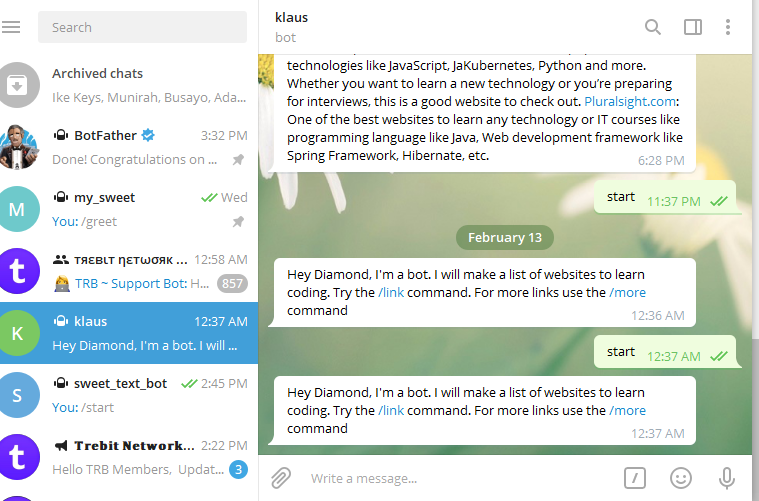

# Telegram_bot

This project involves using ruby to create a telegram_bot. A unique API was generated from telegram Botfather which is used to interact with the bot.
This telegram_bot was created to list out websites that could be helpful for learning how to code online.

# How To Install

- Download telegram app for pc , if you donot have a registered telegram account. you can register with your personal details and phone number.
- search for Botfather to get your unique API, follow this steps to get this done;
  send "/start" and the Botfather will reply with bunch of command.
  reply with "/newbot" to creat a new bot
  select a name to call the bot which is unique
  choose a username to call the bot which must end with the word 'bot'. for example, klaus154_bot.
  once this is done, a unique API token will be sent to you which will be used to interact with the bot from the terminal.
- Open your terminal and type 'touch Gemfile' and put this line of code in the file "gem 'telegram-bot-ruby'"
- In your terminal type 'bundle install' to install the gem required to build the bot
- Copy the generated API token to the token.rb file, make sure its safe to prevent others having access to controlling your bot.

## My Bot

I built a telegram_bot which i called "klaus154_bot" which was inspired by my nick name.

- Follow these instructions on how to use klaus154_bot
  search on your telegram app "klaus154_bot"
  open the chat and type the '/start' command, the bot will respond with some set of instructions to follow which makes it so easy to use the bot.
  type '/link' command which gives links of places to learn how to code
  type '/mopre' command for more links on where to learn how to code.
  if any other command is entered, the bot tells you, I cant handle that, but gives you a clue of command it can handle.
- This bot was created as an inspiration to help people interested in learning how to code but don't know where to start. I also encountered the
  same challenges when I started learning how to code. But with this bot people will know about platforms that can guide them on how to code.The bot creates lists of websites people can learn how to code and also gives a summary of what to expect from those websites.
- I gave the class the name "Nicholas" with the intention to change it to the name of the bot "klaus154_bot".

# Getting Started

To get your own copy of our project simply clone the repository to your local machine.

Step 1: Type the following command into a git shell

git clone https://github.com/diamond-nicholas/Telegram_bot.git

Step 2: Direct a terminal into the cloned repository directory

Type git checkout to "bot" to get the latest code

Step 3: Run the program from command line, then open it in a text editor

## INSTRUCTIONS ON HOW TO USE THE BOT

After all process of getting started;

- Type "bin/main.rb" in the terminal to get the bot running. A prompt "bot is now active...i'm all yours" will be displayed to show that the bot is now active.
- Type "/start" to begin
- To stop the bot from running, open the terminal and type 'ctrl+c' on windows

## BUILT WITH

- Ruby

- Vs-code

- Rubocop linters

- Telegram API

- Ruby gem

## AUTHORS

👤 **Diamond Nicholas**

- GitHub:[@Diamond-Nicholas] (https://github.com/diamond-nicholas)
- Twitter: [@twitterhandle](https://twitter.com/diamondnich)
- LinkedIn: [LinkedIn](https://www.linkedin.com/in/diamond-nicholas/)

## SHOW YOUR SUPPORT

Give a \* if you like the project

## 🤝 Contributing

Contributions, issues, and feature requests are welcome!
Feel free to check the issues page. Show your support
Give a ⭐️ if you like this project!

## Acknowledgments

The Odin Project
lanch Schools

## 📝 License MIT

This project is [MIT](./LICENSE) licensed.
